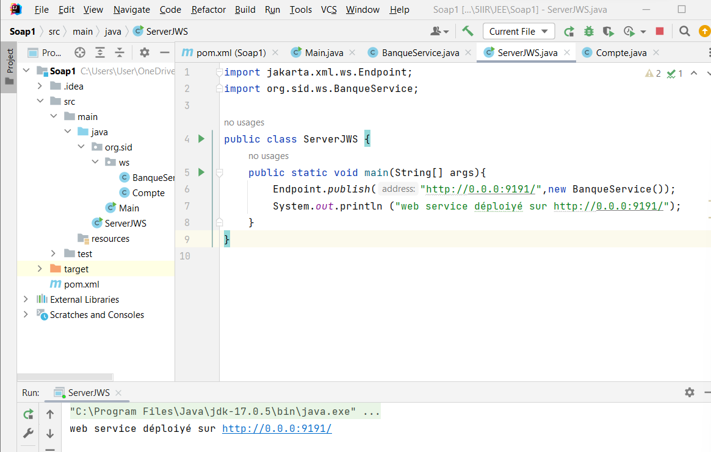

<h1>
Web Service SOAP
</h1>

SOAP (Simple Object Access Protocol) web services are one of the oldest and most commonly used types of web services. They rely on the SOAP protocol, which defines an XML (eXtensible Markup Language) structure for exchanging messages between distributed systems. Here are some key features and concepts of SOAP web services:

<b>1. Protocol:</b>
   SOAP web services use the SOAP protocol for communication between clients and servers. SOAP messages are XML documents that can be sent via HTTP, SMTP (Simple Mail Transfer Protocol), or other protocols.

<b>2. Language Neutrality:</b>
   The use of XML as the message format makes SOAP web services independent of the programming language. Clients and servers can be developed in different languages and run on different platforms.

<b>3. WSDL (Web Services Description Language):</b>
   SOAP web services are typically described using WSDL files. A WSDL file defines the web service interface, including available operations, accepted data types, and access points (URLs) for invoking the service.

<b>4.UDDI (Universal Description, Discovery, and Integration):</b> 
-Description: UDDI is a standard that enables businesses to publish, discover, and integrate with web services. It provides a directory service where businesses can register their web services and consumers can discover these services. 
-Role with SOAP Web Services: UDDI complements SOAP web services by offering a centralized registry where service providers can publish information about their services. Clients looking for specific services can query the UDDI registry to discover suitable providers, making it a vital part of the service-oriented architecture (SOA) ecosystem. 
-Purpose: UDDI serves as a sort of "Yellow Pages" for web services. Businesses can publish details about their available services, such as their WSDL documents, service endpoints, and supported operations. Clients can then search this registry to find services that meet their requirements.
 
<h4>Project Archetecture</h4>

<h4>Application</h4>
<b>1.Create a Web service that allows:</b> 
-Convert an amount from Euro to Moroccan Dirhams (DH) 
-Check an Account 
-Retrieve a List of Accounts 
<b>2.Deploy the Web service using a simple JaxWS Server</b> 

<b>3.Inspect and analyze the WSDL with an HTTP Browser</b> 

<b>4.Test the web service operations using a tool like SoapUI or Oxygen</b> 
 
 
 
<b>5.Create a Java SOAP Client and deploy the Web Service in a Spring Boot Project</b> 
